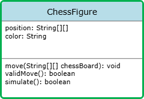
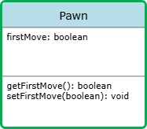
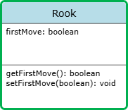
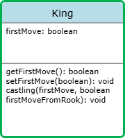
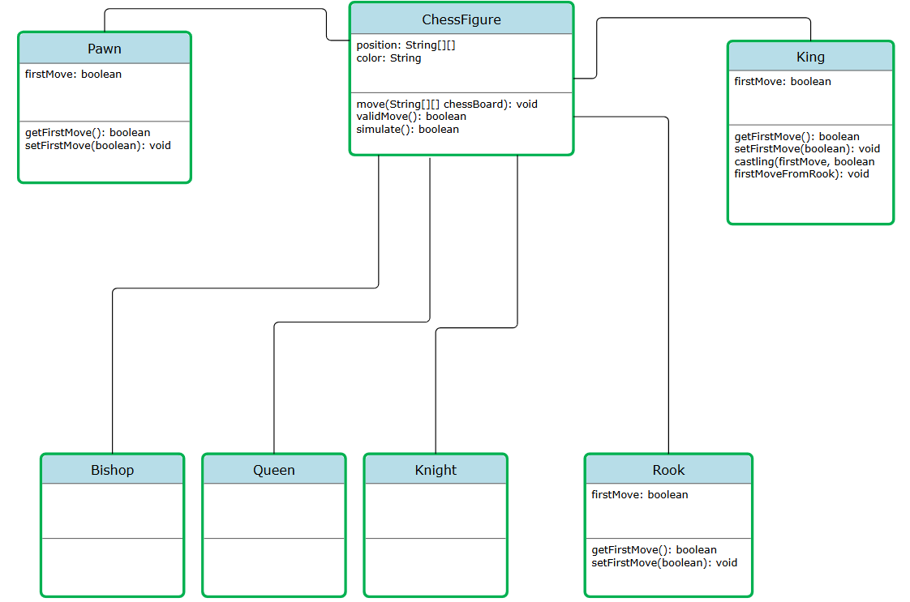

# Changelog

## [Version 1.0.0] - 2025-04-05

### Chess UML Design Idea

**Simple idea**:  
I plan to create a `ChessFigure` class. Furthermore, I will develop several subclasses to describe the various types of chess pieces. These subclasses will inherit from the `ChessFigure` class. This approach seems reasonable for the start. 

This is just the starting point of the project. As I continue, I will delve deeper into the chess rules and start implementing them. This process is likely to lead to some challenges along the way. Additionally, some methods might remain unused at first, so I will organize the various versions of my UML diagrams in a separate folder for future reference.

---

### `ChessFigure`

#### Attributes:

The `ChessFigure` class will have the following attributes:

- **`position: String[][]`**  
  Since I am implementing a 2D-array in Java, the position will be represented as a 2D element.
  
- **`color: String`**  
  A chess piece can either have a black or white color.

---

#### Methods:

The `ChessFigure` class will have the following methods:

- **`move(String[][] chessBoard): String`**  
  This method will handle the movement of the chess piece.

- **`isValidMove(): boolean`**  
  This method should return a boolean indicating whether the move for the figure is valid according to the chess rules. By using this method, I can check if the move adheres to the rules every time a piece moves. I believe this is a reasonable method to ensure valid moves.

- **`simulate(): boolean`**  
  Simulates all possible `move()` options for the current chess figure.  
  This method helps determine whether the figure is capable of threatening the opposing King, in order to evaluate if the game should end.

## `Pawn`

The Pawn is the most basic piece in chess, but it has some special movement rules.

### Movement:
- **Forward:** A Pawn moves **one square forward** along the file.
- **Initial Move:** On its first move, the Pawn can move **two squares forward**, but only if both squares are unoccupied.
- **Capture:** The Pawn captures **diagonally** one square forward (left or right).
- **Promotion:** When a Pawn reaches the 8th rank (for white) or 1st rank (for black), it is promoted to any other piece (except a king), typically a Queen.

### Special Rules:
- **En Passant:** A Pawn can capture an opponent’s Pawn en passant if the opponent’s Pawn moves two squares forward from its initial position, and lands next to the capturing Pawn. This capture must be made immediately, or the opportunity is lost.

### Attributes:

- `isFirstMove: boolean` - Indicates if the Pawn is making its first move (initially `true`).

### Methods:

- `getFirstMove(): boolean` - Returns whether the Pawn is making its first move. Used to check if the special rule for the first move (moving 2 squares forward) can be applied.
- `setFirstMove(boolean): void` - Sets the value for isFirstMove. Used to update whether the Pawn has made its first move or not.

## `Rook`

The Rook is a powerful piece that moves in straight lines.

### Movement:
- The Rook moves horizontally or vertically any number of squares along the row or column, as long as the path is unobstructed.

### Special Rules:
- **Castling:** The Rook is involved in the castling move with the King. The King moves two squares toward the Rook, and the Rook jumps over the King to the square on the opposite side. This can only happen if neither piece has moved before, and there are no pieces between the King and Rook.

### Attributes:

- `firstMove: boolean` - Indicates if the Rook is making its first move (initially `true`).

### Methods:
- `getFirstMove(): boolean` - Returns whether the Rook is making its first move. Used to check if the special rule for castling can be applied.
- `setFirstMove(boolean): void` - Sets the value for `firstMove`. Used to update whether the Rook has made its first move or not.

## `Knight`

The Knight has a unique movement pattern, making it one of the most unpredictable pieces.

### Movement:
- The Knight moves in an **L-shape**: two squares in one direction (vertically or horizontally) and then one square perpendicular to that direction (or vice versa).
- The Knight can **"jump"** over other pieces on the board, meaning it can move to a square even if there are other pieces in between.

### Special Rules:
- The Knight can **jump** over any piece in its path and is the only piece capable of doing so.

### Attributes:
- None

### Methods:
- None

## `Bishop`

The Bishop is a long-range piece that moves diagonally across the board.

### Movement:
- The Bishop moves **diagonally** any number of squares along a diagonal, as long as the path is unobstructed.
- A Bishop is restricted to squares of the color it starts on (i.e., a white-square Bishop will only move on white squares, and a black-square Bishop will only move on black squares).

### Special Rules:
- The Bishop cannot change its color of squares. This means that if it starts on a white square, it will only remain on white squares throughout the game.

### Attributes:
- None

### Methods:
- None

## `Queen`

The Queen is the most powerful piece on the board, combining the movement of both the Rook and the Bishop.

### Movement:
- The Queen moves **vertically, horizontally**, and **diagonally** any number of squares along any of those directions, as long as the path is unobstructed.

### Special Rules:
- The Queen can cover a vast amount of the board in a single move, making it the most versatile piece in chess.

### Attributes:
- None

### Methods:
- None

## `King`

The King is the most important piece in the game. The goal of chess is to checkmate the opponent's King.

### Movement:
- The King moves **one square** in any direction: vertically, horizontally, or diagonally.

### Special Rules:
- **Castling:** The King is involved in the castling move with the Rook (explained under Rook). This move allows the King to move two squares toward a Rook, and the Rook moves to the opposite side of the King.
- **Check and Checkmate:** The King cannot move into check, which means it cannot move to a square that is attacked by an opponent’s piece. The game ends when a King is checkmated (i.e., in check and cannot escape).

### Attributes:
- `firstMove: boolean` - Indicates if the King is making its first move (initially `true`).

### Methods:

- `getFirstMove(): boolean` - Returns whether the King is making its first move. Used to check if the special rule for castling can be applied.
- `setFirstMove(boolean): void` - Sets the value for `firstMove`. Used to update whether the King has made its first move or not.
- `castling(firstMove, boolean firstMoveFromRook): void` - Determines if the King and Rook can perform the castling move. This method checks both if the King and the Rook have not moved yet, and if there are no pieces between them.

## **Result**

After hours of research, I've finally completed the design for my first UML diagram for the chess program. As I mentioned, some attributes or methods may not be needed in the future, so I'll keep the versions updated accordingly.